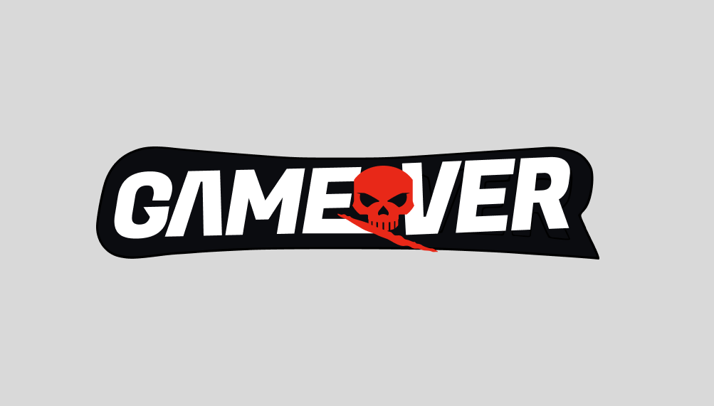

Gamover is a TypeScript-based sports league backend with a companion web frontend.

It combines secure Express APIs, PostgreSQL via drizzle-orm, NBA data routing, and league management features for sign-in, drafts, rosters, memberships, and team trades.

Backend built on Express
Secure middleware stack: CORS, helmet, rate limiting, XSS defense, request logging
PostgreSQL data layer using drizzle-orm and pg
Includes a separate frontend React app

Main domains:
- auth — user sign-in, sign-up, account management, admin user operations
- nba — NBA teams, players, games, and trades
- myleague — create and manage leagues, drafts, rosters, memberships, and team selection
- feed — external sports data integration

### Purpose
It is essentially a fantasy basketball / NBA league management service that handles user accounts, league creation and membership, draft and roster workflows, plus NBA data feeds to power the experience.

